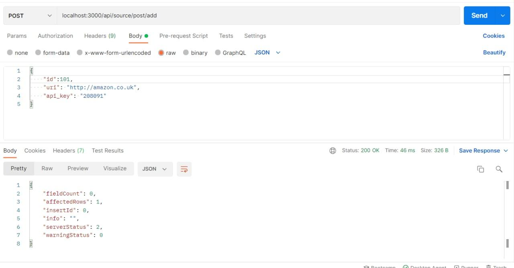
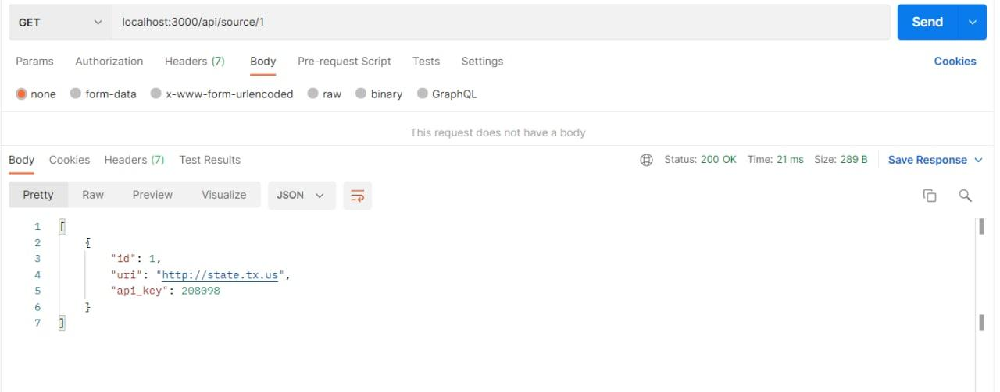
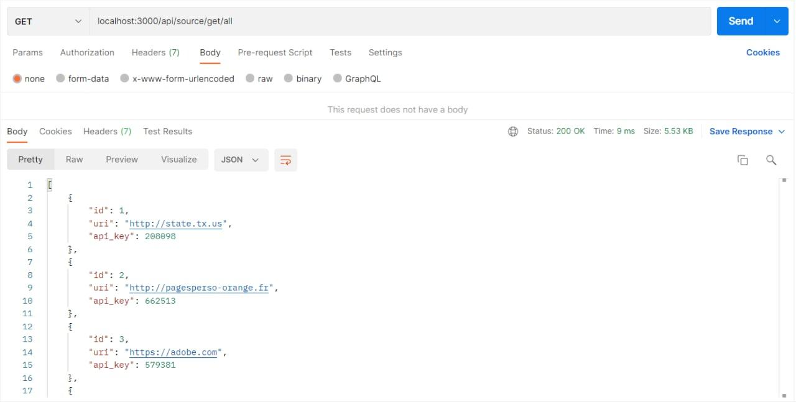
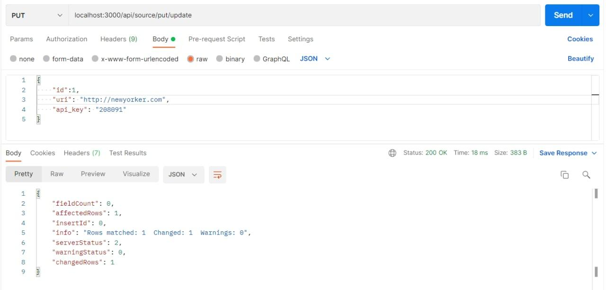
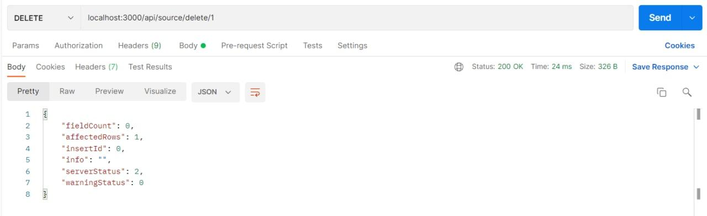

# Тестування працездатності системи

- `/api/source/post/add` - Додати джерело

- `/api/source/:id` - Отримати джерело за його id

- `/api/source/get/all` - Отримати всі джерела

- `/api/source/put/update` - Оновити дані 

- `/api/source/delete/:id` - Видалити джерело за його id

